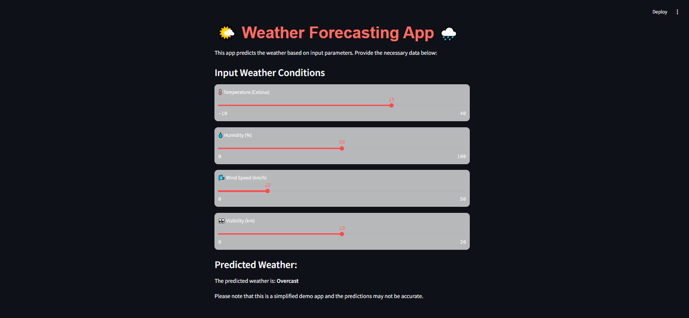

# Weather Forecasting App 🌤️🌧️

## Description
The Weather Forecasting App is a web application developed using Streamlit and a trained machine learning model. It allows users to predict the weather based on key input parameters such as temperature, humidity, wind speed, and visibility. The app provides a user-friendly interface, making it easy for anyone to get weather predictions.

## Interface
 <!-- Replace with the actual image file name or URL -->
